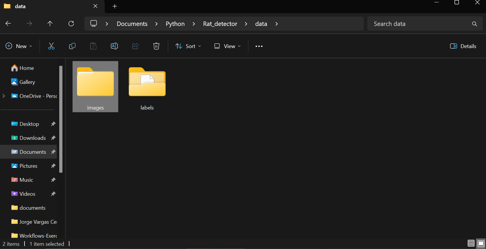
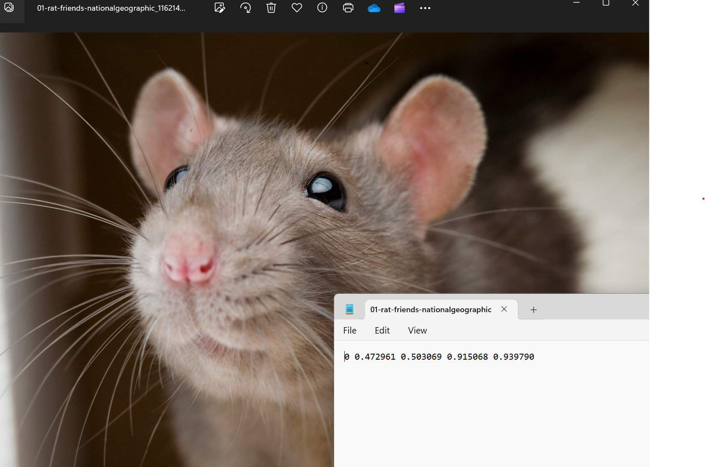
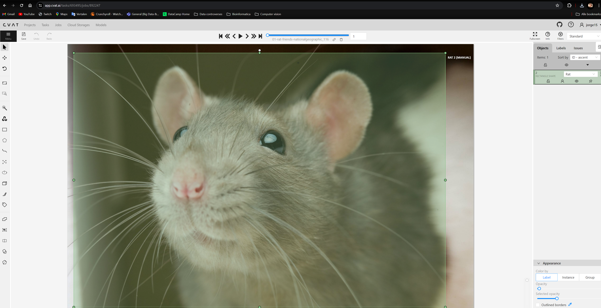
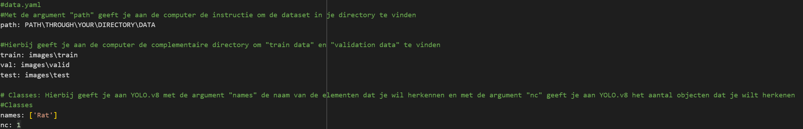
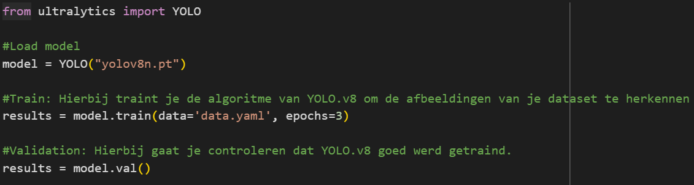
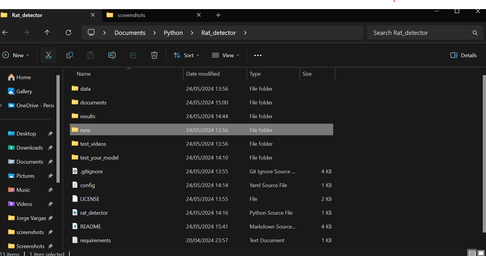
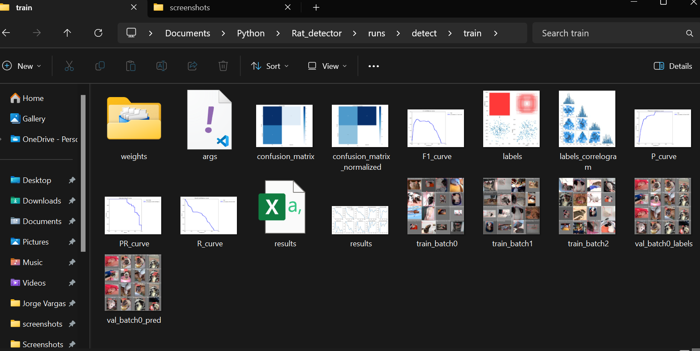

# Project: Rat detector

Een YOLOv8 model getraind om ratten te herkennen.

# Tutorial

## Hoe kan je Yolov8 gebruiken?

Om YOLOv8 te gebruiken, eerst moeten we over de data structuur van YOLOv8 spreken. Deze data structuur bestaat uit twee mappen “images” en “labels” *(Figuur 1)*.

De map **“images”** bestaat uit de verschillende afbeeldingen die worden gebruikt om de algoritme van YOLOv8 te trainen. De map “labels”  bestaat uit verschillende bestanden met de .txt. formaat.

Yolov8 werkt aan de hand van de zogenaamde **“labels”**. In deze labels wordt in het formaat van .txt  de x-axis en y-axis van een specifiek afbeelding beschreven . Met de informatie van de labels wordt aan YOLOv8 gegeven de specifiek gedeelte van de afbeelding waar de filters(Kernels) van de algoritme van YOLOv8 moeten werken.

In de labels staat ook de informatie van de object dat herkend wordt. Stel voor dat je YOLOv8 wil gebruiken om meerdere dieren te herkennen. Hiervoor moet je verschillen labels maken. Als je deze labels open doet, kan je zien dat de elk iteratie een verschillende code heeft. Bijvoorbeeld *(Figuur 2)*: Een **“rat”** heeft de code **“0”**. Dus alle labels met de code “0” geven aan YOLOv8 de informatie dat in de afbeelding van de label een rat zit. 

Dus de informatie van de labels is heel belangrijk om de algoritme van YOLOv8 te trainen. Na het trainen kan de nieuwe getrainde model worden gebruikt om een specifiek object te herkennen. 

## Waar kan je datasets voor YOLOv8 vinden?

Op internet zijn al verschillende datasets met alle informatie nodig om de algoritme van YOLOv8 te trainen. Maar er kan een custom dataset worden gebruikt. Hiervoor zijn de tools **“CVAT”** en **“Roboflow”** beschikbaar. 

Je kan je gekozen afbeeldingen in deze tools uploaden. Nadat de  gekozen afbeeldingen werden geüpload, wordt er handmatig geselecteerd de regio van de afbeelding waar de filters van de algoritme van YOLOv8 gaan werken. Hierdoor gaat CVAT of Roboflow automatisch een .txt bestand genereren met de code van de object en de x-axis en y-axis van de geselecteerde regio *(Figuur 3)*.

Nadat we de dataset hebben gedownload of gemaakt, kunnen we YOLOv8 gebruiken met de volgende codes:

## Training YOLOv8 model

YOLOv8 kan niet voor zichzelf de bestanden van de gekozen dataset zoeken. Hierdoor moet je een .yaml bestand coderen.

Een .yaml bestand geeft de instructie aan je computer om de bestanden van de dataset te vinden. Als je een .yaml schrijft moet op de volgende manier eruit zien:

Nadat we de .yaml bestand hebben gecodeerd, kunnen we de volgende code uitvoeren:

Nadat je de algoritme van YOLOv8 met de foto's van de dataset heb getraind, krijgt je een nieuwe map met de naam "runs" in je directory.

In deze map kan je de verschillende train modellen van de dataset zien. Als je op een van deze mappen klikt, kan de resultaten en "weights" van je getrainde model zien. 

Nadat je je beste getrainde model heb gevonden, kan je je getrainde model gebruiken om ratten van youtube, live videos, foto's te herkennen. Hiervoor kan je de volgende code's in de map **test_your_model** gebruiken.

## Requirements

-   opencv_python==4.8.1.78

-   opencv_python_headless==4.8.0.74

-   ultralytics==8.0.196

## Authors

- [@JorgeVC17](https://github.com/JorgeVC17)

## License

[MIT](https://choosealicense.com/licenses/mit/)

## Bronnen
•	Ultralytics. (z.d.). Python. Ultralytics YOLOv8 Docs. https://docs.ultralytics.com/usage/python/#val

•	Computer vision engineer. (2023, 14 juni). Yolov8 FULL TUTORIAL | Detection | Classification | Segmentation | Pose | Computer Vision [Video]. YouTube. https://www.youtube.com/watch?v=Z-65nqxUdl4

•	Skalski, P. (2023, 24 oktober). Train YOLOV8 on a custom dataset. Roboflow Blog. https://blog.roboflow.com/how-to-train-yolov8-on-a-custom-dataset/
